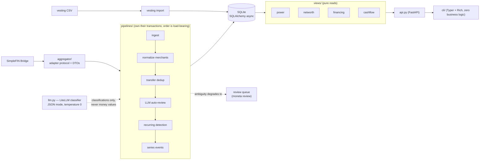

# moneta

[](https://github.com/anirudhlath/moneta/actions/workflows/ci.yml)

Personal finance with one honest number: **monthly spending power = income − fixed costs**.

Every line of that equation is detected automatically from bank data — paychecks,
rent, subscriptions, loan payments — so "how much can I actually spend this month?"
has an answer you can trust without doing data entry.

## Why

Existing apps (Origin, Copilot) fail in four specific ways that moneta is built to fix:

1. **Net worth counts unvested RSUs.** Unvested shares are not money. moneta counts
   only vested holdings; unvested value is shown separately as *potential*.
2. **Subscription detection is unreliable.** moneta detects recurring series with
   deterministic cadence/amount analysis, then emits events when a payment is
   missed or a price increases.
3. **Inter-account transfers aren't deduplicated.** Moving money between your own
   accounts shows up as both spending and income, corrupting every downstream
   number. moneta matches and excludes both legs.
4. **Financing hides the real monthly hit.** A 0%-promo purchase (Synchrony-style
   deferred-interest financing) shows as a lump-sum liability instead of its actual
   monthly cash outflow. moneta derives the payment from observed transfers and
   warns *before* a payoff estimate lands past the promo expiry — the
   deferred-interest cliff.

## Features

- **Spending power** (`moneta power`) — detected income minus detected fixed costs,
  plus spent-so-far and remaining for the current month. Accrual vs. cash-out
  accounting keeps "spent so far" honest when purchases go on credit.
- **Recurring detection** — cadence (weekly/biweekly/monthly/annual) and
  amount-stability analysis over normalized merchants, for outflows (bills) *and*
  inflows (paychecks). Series events: missed payment, price increase, new series.
  Stale series auto-end; a genuinely new charge at cadence revives them.
- **Transfer dedup** — candidate pairs scored on amount, date proximity, and
  account direction; high-confidence pairs auto-link, ambiguous ones escalate.
- **RSU-vesting-aware net worth** — liquid + *vested* holdings − liabilities;
  unvested reported separately, never summed in. Vesting quantities import via CSV
  (`symbol,vested_quantity,unvested_quantity`; a direct Fidelity NetBenefits
  export mapping is tracked in `docs/backlog/high/`).
- **Financing obligations** — derived, not entered: any loan account with a
  detected payment series gets balance ÷ payment = months left, and a
  deferred-interest warning when payoff lands after `promo_expires_on` (the one
  optional manual field in the whole system).
- **LLM as a gated second opinion** — ambiguous classifications go to an LLM in
  strict JSON mode; anything it isn't confident about lands in a human review
  queue. See [the LLM boundary](#the-llm-boundary) below.

## Architecture

FastAPI server owns all logic; the Typer CLI is a thin HTTP client (in-process
ASGI when no server is running, so the CLI works with zero setup). SQLite via
SQLAlchemy async; money is integer cents end-to-end.



Design decisions worth calling out:

- **Adapter boundary** — domain logic never touches SimpleFIN types; DTOs stop at
  `pipelines/ingest.py`. The SimpleFIN beta bridge hard-caps requests to the
  trailing 90 days, so a deep sync is satisfied by walking ≤45-day windows
  backward — that's transport policy, and it lives in the adapter, not the
  pipelines. A Plaid adapter can slot in without touching anything downstream.
- **Pipelines commit; views don't.** Each pipeline stage is idempotent and owns
  its transaction boundary; views are pure reads. `FinancingObligation` is
  computed on read, never stored.
- **Raw payloads are kept**, so pipelines can be re-run when the logic improves
  (`moneta renormalize` re-applies merchant rules to already-synced data).
- **Money is integer cents everywhere**; `Decimal` only at the API boundary.
  Never float.

## The LLM boundary

The design principle, verbatim from the [design doc](docs/superpowers/specs/2026-07-07-moneta-design.md) (§9):

> **Never used for:** arithmetic, balances, anything in the money path. LLM output
> is always a classification that lands in normal columns and is
> auditable/correctable via `moneta review`.

In other words: **the LLM is a classifier gating decisions, never a source of
money values.** Deterministic heuristics run first; the LLM sees only what they
can't resolve — merchant normalization for unrecognized descriptors,
transfer-pair disambiguation, irregular recurring clusters. Concretely:

- **Provider-agnostic via LiteLLM**, JSON response format, temperature 0. Every
  answer is parsed and type-validated before use; a malformed or unconfident
  answer is discarded, not coerced.
- **Confidence-gated**: auto-review prompts require the model to declare
  `"confident": true`, and answers are validated against the actual candidate set
  (e.g. a proposed transfer match must be one of the real candidates).
- **Graceful degradation**: every pipeline takes `Classifier | None`. With no LLM
  configured (or on any LLM failure), ambiguity degrades to a `ReviewItem` and a
  human resolves it with `moneta review`. Sync never crashes on an LLM error.
- **Auditable**: LLM resolutions flow through the exact same resolution path a
  human answer takes, tagged `resolved_by="llm"`.

## Quickstart

Requires Python 3.13+ and [uv](https://docs.astral.sh/uv/).

```bash
uv sync
uv run moneta setup simplefin <SETUP_TOKEN>   # get one at https://beta-bridge.simplefin.org
uv run moneta sync
uv run moneta power
```

The first sync pulls all history your institutions retain. `moneta sync --full`
re-pulls everything — use it after linking a new account so its history isn't
skipped by the incremental window.

No server needed — the CLI runs the app in-process. To run a server instead:
`uv run moneta serve`, then `export MONETA_API_URL=http://127.0.0.1:8300`.

To enable the LLM second opinion, set `MONETA_LLM_MODEL` to any
[LiteLLM model string](https://docs.litellm.ai/docs/providers) (e.g.
`anthropic/claude-sonnet-4-5`), with the provider's API key in the environment.
Unset = no LLM; ambiguous items go to `moneta review` instead.

## Commands

| Command | What it does |
|---|---|
| `moneta sync [--full]` | Pull latest data and run all pipelines |
| `moneta power` | Income, fixed costs, spending power, spent so far, remaining |
| `moneta networth` | Net worth (vested only); unvested listed as potential |
| `moneta cashflow [--start D --end D]` | Accrual spend vs cash out for a range (default: this month) |
| `moneta recurring [--events] [--end ID]` | Series; missed payments and price increases; cancel a series |
| `moneta obligations` | Loans/financing: payment, months left, deferred-interest warnings |
| `moneta review` | Resolve ambiguous classifications interactively |
| `moneta accounts [--set-type ID TYPE] [--set-promo ID DATE]` | List accounts; set type / promo expiry |
| `moneta import vesting <file.csv>` | Vesting data (`symbol,vested_quantity,unvested_quantity`) |
| `moneta renormalize` | Re-apply improved merchant rules to already-synced data |
| `moneta serve` | Run the FastAPI server |

## Configuration

Env vars (`MONETA_*`) override `~/.config/moneta/config.toml`:
`MONETA_SIMPLEFIN_ACCESS_URL`, `MONETA_LLM_MODEL`, `MONETA_API_URL`,
`MONETA_DB_PATH`, `MONETA_CONFIG_DIR` (config-file location; default
`~/.config/moneta`).

## Development

```bash
uv sync
uv run pytest -q                      # full suite, hermetic (fake adapter + fake LLM)
uv run ruff check . && uv run ruff format --check .
uv run mypy --strict src tests
```

All of the above must pass before every commit (CI enforces the same gate).
Tests cover the pipelines end-to-end against a fake aggregator and a scripted
LLM — no network, no real accounts.

## Design docs

- [Design doc](docs/superpowers/specs/2026-07-07-moneta-design.md) — problem,
  architecture decisions, data model, pipeline specs, LLM usage rules
- [Backlog](docs/backlog/) and [QA backlog](docs/qa-backlog/) — deferred work and
  manual test cases, one file per item

## License

[MIT](LICENSE)
